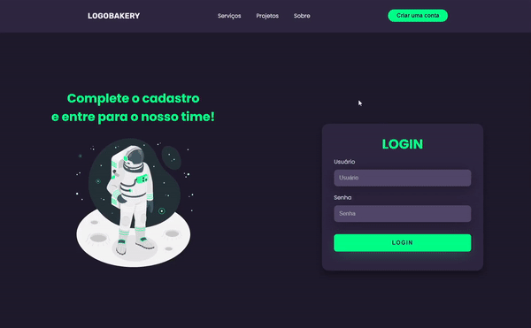

# Responsive Login Page

In this project I implemented small things that I learned while studying HTML and CSS, such as *responsive cards, footer and navigation bar*

## 🖥 Preview

 
## 🚀 Technologies 
* HTML
* CSS

## ⚠️ Future Changes
* Implement new features while learning
